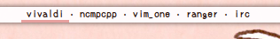

# Script: polywins
A [Polybar](https://github.com/jaagr/polybar) script forked from [polybar-windows](https://github.com/aroma1994/polybar-windows) with additional features.
* Left click: Focus window and raise it if it is minimized. If the window is already focused, minimize it.
* Middle click: Close the window.
* Right click: Select a rectangle for the window to be re-positioned to.
* Mouse wheel: Resize the window incrementally.

<sub>For a very limited multihead implementation, check out the [multihead branch](https://github.com/alnj/polywins/tree/multihead).</sub>


## Configuration

The following variables at the top of the file may be customized:
| Setting | Description |
| --- | --- |
| ``active_text_color="#250F0B"`` | The color of the name of the active window. |
| ``active_underline="true"`` | Whether to underline the active window. |
| ``active_underline_color="#E7A09E"`` | The color of the active window underline. |
| ``inactive_text_color="#503631"`` | The color of the name of inactive windows. |
| ``inactive_underline="false"`` | Whether to underline inactive windows. |
| ``inactive_underline_color="#F1EF7D"`` | The color of inactive window underline. |
| `separator="·"` | Character displayed between window names. |
| `display="window_class"` | Choose whether to display window_title, window_class or window_classname. |
| `case="normal"` | Options: normal, upper, lower. |
| ``max_windows="15"`` | Maximum number of displayed windows. Useful if you have limited space. Will show how many windows are hidden. (e.g. `+3`)|
| `add_spaces="true"` | Whether to add a space to the side of each window name. |
| `char_limit=20` | Maximum window name length after which it will be truncated. |
| `resize_increment=30` | Size in pixel of resizing steps for the mouse wheel functions. |
| `wm_border_width=0` | Setting this variable might make resizing positions more accurate. |


## Installing

* Save `polywins.sh`, for example to `~/.config/polybar/scripts`.
* Make the script executable with `chmod +x ~/.config/polybar/scripts/polywins.sh`.
* Change any setting you wish at the top of the script.
* Add the following module to your polybar config:
```ini
[module/polywins]
type = custom/script
exec = ~/.config/polybar/scripts/polywins.sh 2>/dev/null
format = <label>
label = %output%
label-padding = 1
interval = .5
```
* Add the module to one of your bars, for example like so:
```ini
[bar/your_bar_name]
modules-center = polywins
```

## Dependencies

* `xprop`
* `wmctrl`
