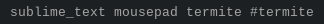

# Script: polybar-windows

A [Polybar](https://github.com/jaagr/polybar) script that shows opened windows on your current display (if there's an active window it's marked by #-symbol). You can click on any window title to switch on it.




## Dependencies

* `xprop`
* `wmctrl`


## Module

```ini
[module/polybar-windows]
type = custom/script
exec = polybar-windows.sh
format = <label>
label = %output%
label-padding = 1
interval = 1
tail = true
```
